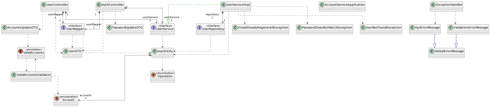

### Descripcion
Servicio de Cuentas construido siguiendo los principios de una REST API y las mejores practicas en Spring y Spring Boot.
Construido sobre una Arquitectura por Capas.

### Especificacion
Endpoints disponibles:
- GET api/v1/users/{{id}} - Recupera un unico usuario de la base de datos basado en su ID.
- GET api/v1/users - Recupera multiples usuarios de la base de datos (10 por defecto). Puede llegar hasta 20 (basado en la configuracion default) enviando la notacion page?= y size=?.
- POST api/v1/users - Registra un nuevo usuario a la base de datos. El JSON enviado debe contener: name, lastName, email, password.
- DELETE api/v1/users/{{id}} - Borra un unico usuario de la base de datos basado en su ID.
- PATCH api/v1/users/{{id}}/accounst - Actualiza las cuentas de un usuario basado en su ID. El JSON debe contener: operation, accounts(arr).
- PATCH api/v1/users/{{id}}/password - Actualiza la contraseña de un usuario basado en su ID. El JSON debe contener: oldpassword, newpassword.

Puedes probar todos los endpoint en tu maquina importando [esta coleccion de postman](./docs/Account%20Service.postman_collection.json).

Puedes ver mas detalles en [como importar una coleccion de Postman aqui](https://learning.postman.com/docs/getting-started/importing-and-exporting-data/#importing-data-into-postman)

### 💬 Diagrama de Clases

### 💻 Tecnologias
- Java 11
- Maven 3.6.3
- Spring
- Spring Boot
- Spring Data
- Spring MVC
- MySQL (MariaDB fork)

Gracias a la comunidad Open Source que contribuye a las librerias:
- MapStruct
- Lombok
- H2 and MariaDB drivers
- All the Spring starter dependencies