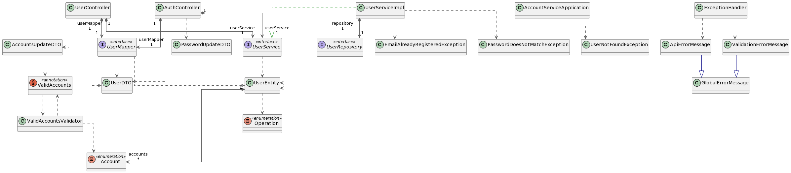

> *Puedes consultar la documentacion en español [aqui](./README.es.md)*

### Description
Account Service following the principles of a REST API and the best practices using Spring and Spring boot. 
Built using Layered Architecture.

### Specification
Available endpoints:
- GET api/v1/users/{{id}} Retrieves one unique user from the database based on its unique ID.
- GET api/v1/users Retrieves multiple users from the database (10 users by default). It can go up to 20 (per default configuration) sending page?= and size?= notation.
- POST api/v1/users Registers a new user into the database. The JSON must contain: name, lastName, email, password.
- DELETE api/v1/users/{{id}} Deletes one user from the database based on its unique ID.
- PATCH api/v1/users/{{id}}/accounst Updates the User Accounts based on its unique ID. The JSON structure must contain: operation, accounts(arr).
- PATCH api/v1/users/{{id}}/password Updates the User password based on its unique ID. The JSON structure must contain: oldpassword, newpassword.

Test all this endpoints on your own machine using [this postman collection](./docs/Account%20Service.postman_collection.json).

You can find details on [how to import a Postman collection here](https://learning.postman.com/docs/getting-started/importing-and-exporting-data/#importing-data-into-postman)

### 💬 Class Diagram

### 💻 Technologies 
- Java 11
- Maven 3.6.3
- Spring
- Spring Boot
- Spring Data
- Spring MVC
- MySQL (MariaDB fork)

Thanks to all the open source contributors on:
- MapStruct
- Lombok
- H2 and MariaDB drivers
- All the Spring starter dependencies